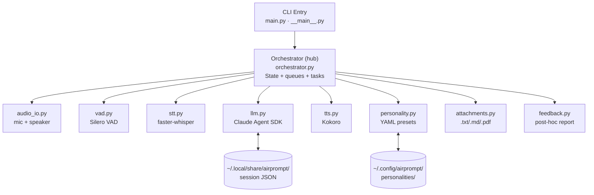
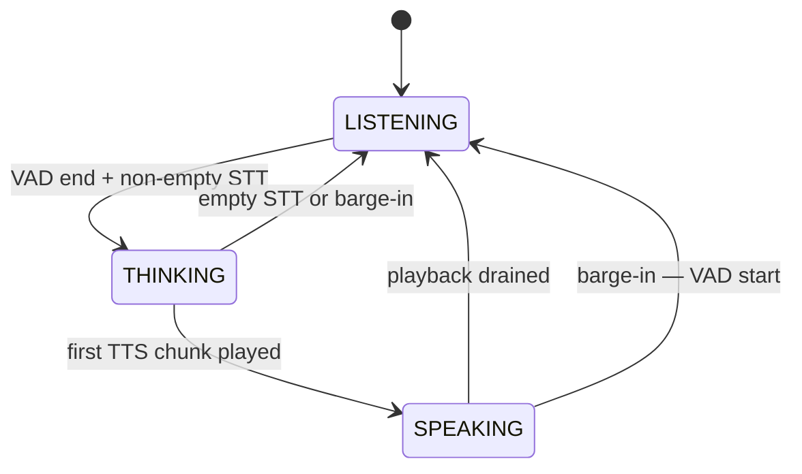
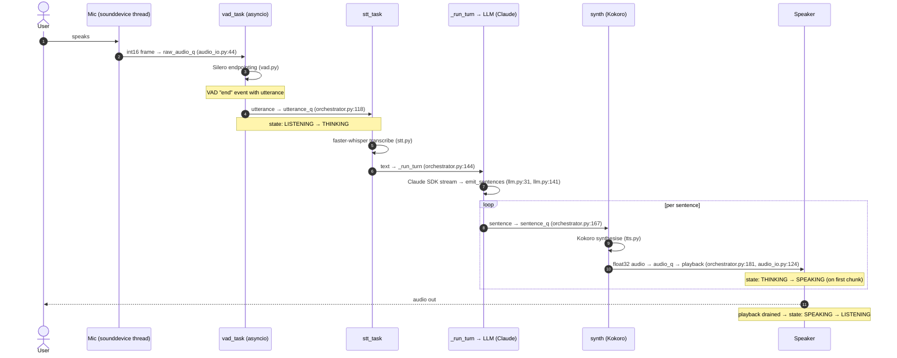
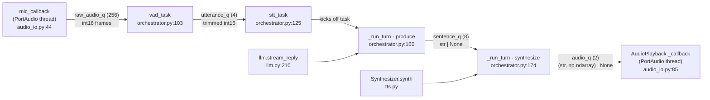

# AirPrompt — Code Flow

Four diagrams that let you understand AirPrompt without reading the source line-by-line. Each diagram demonstrates a transferable technique for grokking any codebase. All Mermaid blocks render on GitHub; ASCII fallbacks follow for terminal-only viewing.

**Recommended order:** Diagram 1 (where things live) → Diagram 2 (when state changes) → Diagram 3 (what happens on one user turn) → Diagram 4 (what data flows where).

---

## 1. Layered Architecture — *map the borders*

Technique: before reading logic, look at boundaries (entry, hub, leaves, persistence, config). Everything orbits the orchestrator.



**ASCII fallback:**
```
                          ┌──────────────────────────┐
                          │  CLI Entry (main.py)     │
                          └────────────┬─────────────┘
                                       ▼
   ┌──────────┐         ┌──────────────────────────────┐         ┌──────────┐
   │ Config   │◄───────►│   Orchestrator (the hub)     │◄───────►│ Sessions │
   │ ~/.config│         │   state + queues + tasks     │         │ JSON     │
   └──────────┘         └──────┬─────────────────┬─────┘         └──────────┘
                               │                 │
        ┌──────────┬───────────┼─────┬───────────┼──────────┬─────────┐
        ▼          ▼           ▼     ▼           ▼          ▼         ▼
    audio_io     vad         stt    llm         tts    personality  feedback
    (mic/spk)  (Silero)  (whisper)(Claude)   (Kokoro)   (YAML)      (report)
```

**Why this matters:** every other diagram is a slice through this one. If you forget where a file lives, come back here first.

---

## 2. State Machine — *trace control flow*

Technique: identify the smallest finite state machine that captures the system's behavior. Three states, four edges, the whole app.



**Edge → source mapping:**

| Transition | Where in code |
|---|---|
| LISTENING → THINKING | [orchestrator.py:113-121](../src/airprompt/orchestrator.py#L113-L121) |
| THINKING → SPEAKING | [orchestrator.py:200-201](../src/airprompt/orchestrator.py#L200-L201) |
| SPEAKING → LISTENING (drain) | [orchestrator.py:204-205](../src/airprompt/orchestrator.py#L204-L205) |
| THINKING → LISTENING (empty / barge-in) | [orchestrator.py:131-132](../src/airprompt/orchestrator.py#L131-L132), [orchestrator.py:306-324](../src/airprompt/orchestrator.py#L306-L324) |
| SPEAKING → LISTENING (barge-in) | [orchestrator.py:110-112](../src/airprompt/orchestrator.py#L110-L112) |

**ASCII fallback:**
```
               VAD end + STT non-empty
   ┌───────────┐  (orchestrator.py:113) ┌──────────┐
   │ LISTENING │ ────────────────────►  │ THINKING │
   │           │                        │          │
   │           │ ◄──────────────────────│          │
   └───────────┘  barge-in / empty STT  └────┬─────┘
        ▲          (orchestrator.py:306)     │
        │                                    │ first TTS chunk
        │                                    │ (orchestrator.py:200)
        │   playback drained                 ▼
        │  (orchestrator.py:204)        ┌──────────┐
        └───────────────────────────────│ SPEAKING │
                                        │          │
                  barge-in (VAD start)  │          │
        ◄───────────────────────────────│          │
            (orchestrator.py:110)       └──────────┘
```

**Why this matters:** any bug involving "the app got stuck" or "it didn't listen after speaking" is an edge in this diagram that didn't fire. Knowing the four edges by heart lets you debug by elimination.

**Key invariants** (worth verifying when reading [orchestrator.py](../src/airprompt/orchestrator.py)):
- VAD runs in *every* state (not just LISTENING) — that's how barge-in works.
- `_turn_task` only exists in THINKING/SPEAKING — barge-in cancels it.
- Speaking uses a *higher* VAD threshold to ignore speaker bleed-through ([vad.py](../src/airprompt/vad.py)).

---

## 3. Sequence Diagram — *follow one request end-to-end*

Technique: trace one user-visible action through every layer. Ignore branches, helpers, error paths on the first pass. This single exercise reveals more architecture than a week of file-by-file reading.

**The action:** user speaks one sentence; Claude replies; the system goes back to listening.



**Side note — barge-in:** if `vad_task` detects a *start* event while state ≠ LISTENING ([orchestrator.py:110-112](../src/airprompt/orchestrator.py)), it spawns `_barge_in()`:
1. Call `self._llm.interrupt()` — tells the SDK to stop yielding but keep draining (avoids desync, see [orchestrator.py:212-223](../src/airprompt/orchestrator.py)).
2. `self._playback.flush()` — drops queued audio ([audio_io.py:138](../src/airprompt/audio_io.py)).
3. Cancel `_turn_task` and reset to LISTENING.

**ASCII fallback:**
```
User    Mic         vad_task     stt_task    LLM(Claude)   synth(Kokoro)  Speaker
 │       │              │            │            │             │            │
 │──speech─▶            │            │            │             │            │
 │       │──raw_audio_q▶│            │            │             │            │
 │       │              │ (Silero)   │            │             │            │
 │       │              │──utterance_q───▶        │             │            │
 │       │              │            │  [LISTENING → THINKING]  │            │
 │       │              │            │──whisper──▶│             │            │
 │       │              │            │            │──sentence──▶│            │
 │       │              │            │            │             │──audio───▶ │
 │       │              │            │            │             │   [THINKING│
 │       │              │            │            │             │ → SPEAKING]│
 │  ◀────────────────────────────────────────────────────────────────────────│
 │       │              │            │            │             │ [drained → │
 │       │              │            │            │             │  LISTENING]│
```

**Why this matters:** if you can sit on top of this single trace, you can pin any new question ("where is X handled?") to a specific arrow. Most "I'm lost" feelings come from not having traced one end-to-end path.

---

## 4. Queue Topology — *focus on data, not files*

Technique: code is plumbing; the data moving through queues is what the system actually does. Once you know every producer and consumer for each queue, you've cornered the concurrency model.



**ASCII fallback:**
```
  ┌─────────────┐                      ┌─────────────┐
  │ mic_callback│──raw_audio_q(256)──▶│  vad_task   │
  │  (thread)   │   int16 frames       │ (asyncio)   │
  │ audio_io:44 │                      │ orch:103    │
  └─────────────┘                      └──────┬──────┘
                                              │ utterance_q(4)
                                              │ trimmed int16
                                              ▼
                                       ┌─────────────┐
                                       │  stt_task   │
                                       │ orch:125    │
                                       └──────┬──────┘
                                              │ create_task
                                              ▼
        ┌─────────┐   sentence_q(8)   ┌─────────────┐  audio_q(2)   ┌─────────────┐
        │ produce │──────────────────▶│  synthesize │──────────────▶│  playback   │
        │  (LLM)  │   str | None      │   (Kokoro)  │ (sentence,    │  (thread)   │
        │ orch:160│                   │  orch:174   │  np.ndarray)  │ audio_io:85 │
        └─────────┘                   └─────────────┘                └─────────────┘
```

**Queue sizes encode design intent** (cross-check at [orchestrator.py:85-86](../src/airprompt/orchestrator.py), [orchestrator.py:156-157](../src/airprompt/orchestrator.py)):

| Queue | Size | Why |
|---|---|---|
| `raw_audio_q` | 256 | ~8 s of 32 ms frames — survives brief STT stalls without dropping mic frames |
| `utterance_q` | 4 | Backlog of unprocessed utterances; full → drop with warning (orchestrator.py:120) |
| `sentence_q` | 8 | Buffers Claude's stream while TTS catches up |
| `audio_q` | 2 | Tight — keeps mouth-to-ear latency low; synth blocks if playback is behind |

**Why this matters:** when you suspect a deadlock, frame drop, or latency regression, the answer is almost always "which queue is full or empty and why." This is the diagram to keep open while debugging timing issues.

---

## How to use these diagrams

If you're new to AirPrompt, the fastest read is:

1. **Diagram 1** (1 min) — where things are.
2. **Run the app** with `LOG_LEVEL=DEBUG` and speak one sentence. Watch the state transitions print.
3. **Diagram 2** (2 min) — match the printed transitions to the state edges. Force a barge-in and watch the SPEAKING→LISTENING edge fire.
4. **Diagram 3** (5 min) — read it side-by-side with [orchestrator.py](../src/airprompt/orchestrator.py).
5. **Diagram 4** (3 min) — read last; this is the one you'll come back to when something breaks.

Total time: **~15 minutes** to a working mental model. Compare to reading every `.py` cold (~2 hours, and you still won't have grasped the concurrency).

Once you can answer "what happens when the user speaks while Claude is talking?" without opening any source file, you understand AirPrompt's flow.
